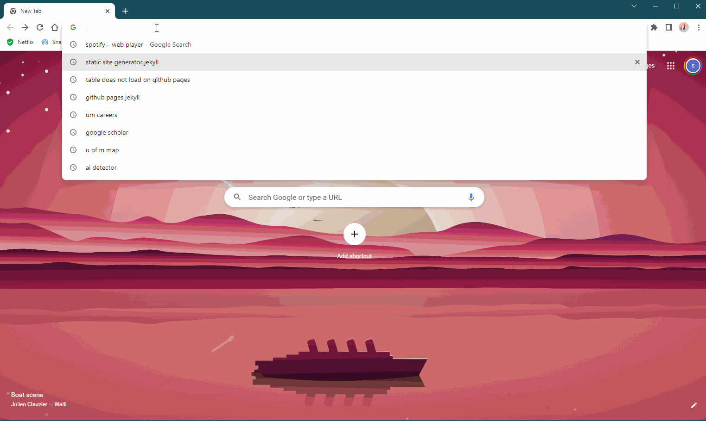

# Hosting a Resume with Markdown, VS Code, GitHub Pages, and Jekyll

## Purpose

This README's goal is to outline the detailed procedures for hosting and formatting a resume using Markdown, VS Code, GitHub Pages, and Jekyll. The general guidelines of contemporary technical writing, as outlined in Andrew Etter's book Modern Technical Writing, will also be related to these practical processes.

## Prerequisites

- You'll need a resume that is Markdown-formatted before you can proceed with the guidelines below. If you are new to Markdown, we suggest starting with a Markdown tutorial, a link for which can be found in [more resources section](#more-resources).
- [Git](https://git-scm.com/downloads)
- [VS Code](https://code.visualstudio.com/download)

## Instructions

### Step 1: Set up your project

1. Open VS Code.
2. Go to `File > Open Folder` and select a new empty folder for your website project.
3. In VS Code, create a new file in your project folder and name it `index.md`.
4. This file will serve as the main page of your website.
5. Open your Markdown resume file in a separate tab in VS Code.
6. Copy the contents of your Markdown resume file into `index.md`.
7. Add front matter to `index.md` to specify the layout and metadata for your website.
8. Front matter is a YAML block that appears at the beginning of your file and tells Jekyll how to handle the file.
9. Here is an example:

```
---
layout: default
title: [Your Name] - Resume
---
```
The layout parameter specifies the layout to use for the page, and the title parameter specifies the title of the page, which will appear in the browser tab and search results.

10. Save index.md to ensure that your changes are preserved.

### Step 2: Install Jekyll

1. Install Jekyll by following the [official installation guide](https://jekyllrb.com/docs/installation/).
2. This will install all the necessary components and dependencies to run your website.

### Step 3: Create a new Jekyll site

1. In VS Code, open the terminal (`Ctrl+` ` (Windows) or `Cmd+` ` (Mac)).
2. Navigate to your project folder using the `cd` command.
3. Create a new Jekyll site in your project folder by running `jekyll new .`
4. This will create all the necessary files and folders for a basic Jekyll site.

### Step 4: Serve and preview your website

1. In the terminal, run `bundle exec jekyll serve` to build and serve your website.
2. This will generate your site and make it available at `http://localhost:4000`.
3. Open your web browser and go to `http://localhost:4000` to view your website.
4. This is a good opportunity to check that your website is working as expected.

### Step 5: Commit and push changes

1. In VS Code, press `Ctrl+Shift+G` (Windows) or `Cmd+Shift+G` (Mac) to open the Source Control panel.
2. Stage all changes by clicking on "+" next to each file in the list of changes.
3. Enter a commit message (e.g., "Add initial version of resume") in the text field at the top of the panel.
4. Press `Ctrl+Enter` (Windows) or `Cmd+Enter` (Mac) to commit changes.
5. Click on the "..." icon in the top right corner of the Source Control panel and select "Push" to push changes to GitHub.

That's it! You have successfully hosted and formatted a resume using Markdown, VS Code, GitHub Pages and Jekyll.

## Relating to Technical Writing Principles

1. Utilize Lightweight Markup Languages: Etter advocates creating technical documentation using lightweight markup languages such as Markdown. This approach is followed by utilising Markdown to format your resume.

2. Automate Documentation Tasks: Etter also suggests using technologies like Jekyll to automate documentation chores. This idea is followed by utilising Jekyll to convert your Markdown file to HTML and host your website.
3. Web-Publish Documents: Etter proposes making documents available on the web in order to reach a larger audience. You can host your CV on GitHub Pages or Codeberg.

## More Resources

1. [Markdown tutorial](https://www.markdowntutorial.com/)
2. [Modern Technical Writing by Andrew Etter](https://www.amazon.com/Modern-Technical-Writing-Introduction-Documentation-ebook/dp/B01A2QL9SS)
3. [Jekyll documentation](https://jekyllrb.com/docs/)

## Authors and Acknowledgments

This README was written by Sahilpreet.
Also, the author would like to acknowledge his teammates (Group 16) :

- Jasmine Tabuzo 
- Eric Shu 
- Kha Pham 

## FAQs

### Why is Markdown better than a word processor?

It's simple to learn and utilise the lightweight markup language known as markdown. It enables plain text formatting, which is quicker and more effective than using a word processor. Moreover, Markdown generates clear, clean HTML code, making it simpler to convert your content to other forms like PDF or HTML.

### Why is my resume not showing up?

There could be a few reasons why your CV does not appear on your website. To begin with, confirm that your resume file is saved in the appropriate place and has the appropriate name. Second, check that your resume file's front matter is properly formatted. Finally ,confirm that your website is being delivered correctly and that your Jekyll configuration file is configured appropriately. If you are still having problems, look for answers in Jekyll's documentation or get support from internet forums.
